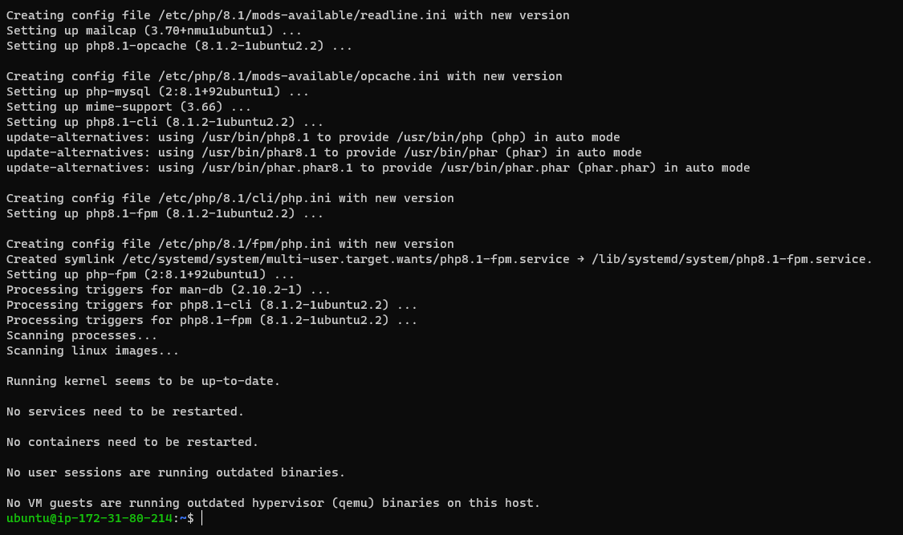

# MY PROJECT-2 DOCUMENTATION

## Installing the Nginx Web Server

`sudo apt update`

`sudo apt install nginx`

`sudo systemctl status nginx`

## Installing Mysql

` sudo apt install mysql-server`

`sudo mysql`

`ALTER USER 'root'@'localhost' IDENTIFIED WITH mysql_native_password BY 'PassWord.1';`

`sudo mysql_secure_installation`

`sudo mysql -p`

`sudo mysql -p`

## Installing Php

`sudo apt install php-fpm php-mysql`

## Configuring Nginx to Use Php Processor

`sudo mkdir /var/www/projectLEMP`

`sudo chown -R $USER:$USER /var/www/projectLEMP`

`sudo nano /etc/nginx/sites-available/projectLEMP`

`sudo ln -s /etc/nginx/sites-available/projectLEMP /etc/nginx/sites-enabled/`

`sudo nginx -t`

`sudo unlink /etc/nginx/sites-enabled/default`

`sudo systemctl reload nginx`

`sudo echo 'Hello LEMP from hostname' $(curl -s http://169.254.169.254/latest/meta-data/public-hostname) 'with public IP' $(curl -s http://169.254.169.254/latest/meta-data/public-ipv4) > /var/www/projectLEMP/index.html`

## Testing Php With Nginx

 `sudo nano /var/www/projectLEMP/info.php`

 

 `sudo rm /var/www/your_domain/info.php`

 `sudo mysql`

 `CREATE DATABASE `example_database`;`

 ` CREATE USER 'example_user'@'%' IDENTIFIED WITH mysql_native_password BY 'password';`

 `GRANT ALL ON example_database.* TO 'example_user'@'%';`

 `mysql> exit`

 `mysql -u example_user -p`

 `SHOW DATABASES;`

 `mysql CREATE TABLE example_database.todo_list (
    ->      item_id INT AUTO_INCREMENT,
    ->      content VARCHAR(255),
    ->      PRIMARY KEY(item_id)
    ->  ); `

 ` INSERT INTO example_database.todo_list (content) VALUES ("My first important item");`

 ` SELECT * FROM example_database.todo_list;`

 `nano /var/www/projectLEMP/todo_list.php`

 .PNG)

 

 

 
 